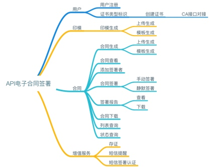
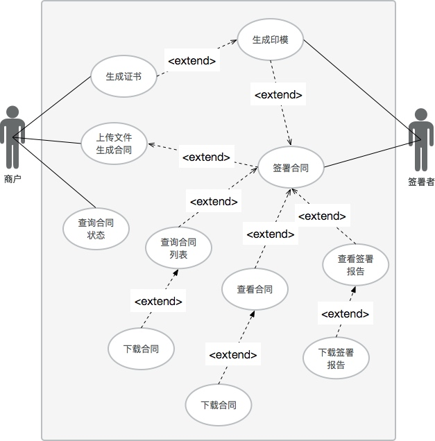
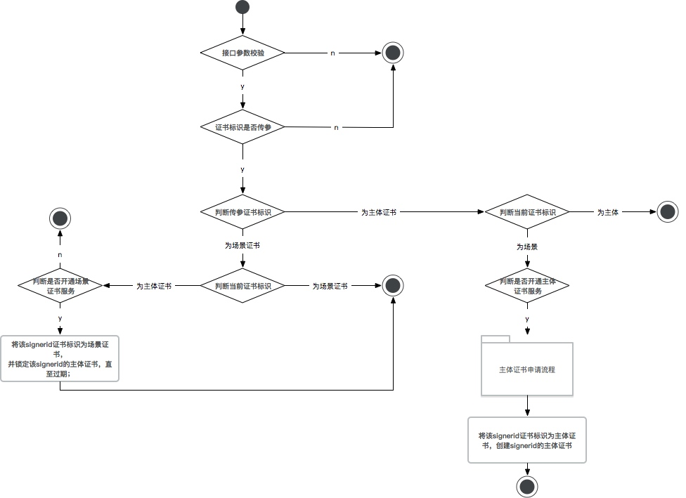
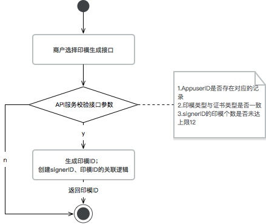
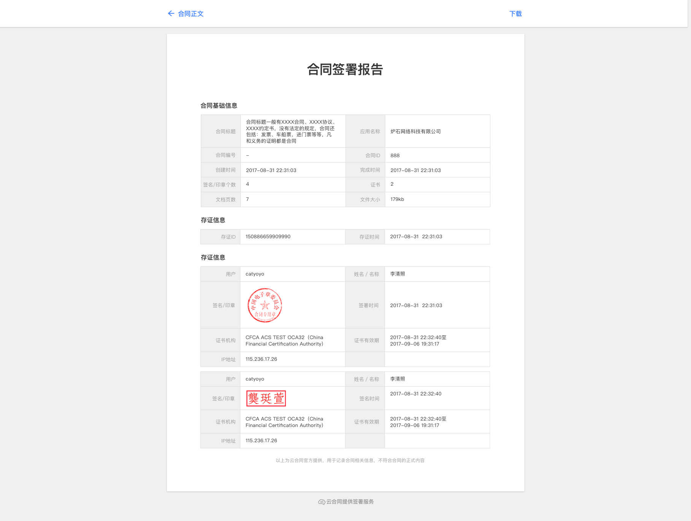
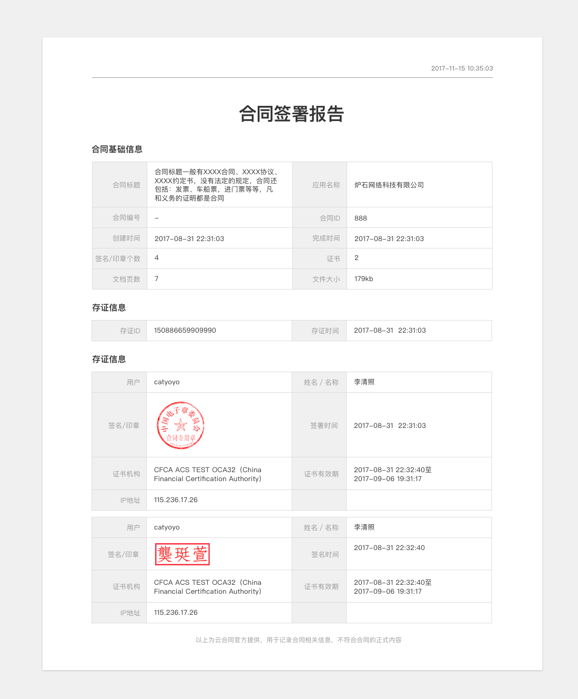
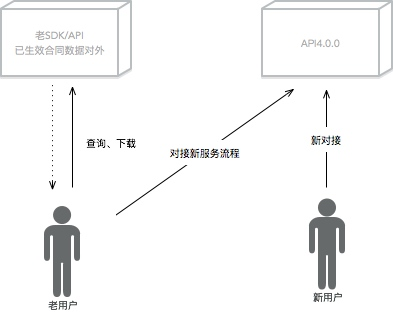

<!--这是全局属性定义-->

<span id="dir"></span>

<!--这是正文开始的地方-->

[TOC]

#API电子合同签署

```
Version:v4.0.0    Author:xixin    
```

##修订记录

Versions | Revise contents | Date
-------- | --------------- | ----
1.0.3    | 1.印模上限机制变更;2.用户信息更新接口修订； | 2017-11-18 12:59:08

##需求概述
###背景

>出现大量的个性化需求逻辑，对底层代码架构的影响越来越严重；
>
>对多变的各类需求，现解决方案无法健康的满足；
>
>现解决方案中，存在大量的规范化、专业化的不足；

###目的

>实现加大API电子合同产品线的拓展性，满足更多业务场景；
>
>通过对底层代码架构的优化，在整体的需求实现与设计中，遵循一定的原则，使其更加的稳定可靠；
>
>通过新定义的业务模型，沉淀出差异化，提升产品竞争力；

###功能架构
####功能架构图



####用例图



####业务流程图

暂略

###词汇表

| 词汇 | 解释 |
| :-- | :-- |
| 个人用户 | 区别于企业用户，泛指独立的自然人；在API服务中，个人用户来源于商户的应用，商户需要通过个人用户注册接口进行用户数据的导入注册； |
| 企业用户 | 区别于个人用户，泛指企业、组织、机构，商户需要通过用户注册接口进行用户数据的导入注册；在API服务中，企业用户来源于商户的应用，商户需要通过企业用户注册接口进行用户数据的导入注册； |
| 商户 | 指与我方建立合作关系，一般为采购我方服务的企业、组织、机构，在API4.0.0中指有权调用服务相关接口的角色； |
| 应用 | 泛指商户应用，在我方开放平台中创建，用于对接其采购的具体服务的应用；一个商户，可以具有多个应用，应用分为正式应用与测试应用； |
| 产品 | 指我方对外提供的服务，如API电子合同签署v4.0.0，存证v2.0.0，个人数据服务，企业验证服务； |
| 服务 | 服务分为两部分来理解，一是内部系统的基础服务，如短信服务，支付系统，其落地在应用层时归属于某产品的可配置服务；二是依附于某产品的可配置的内容，如CA，签署认证服务； |
| signerID | 指用户在系统中的唯一标识；SignerId的生成规则：商户ID+系统生成的顺序数字+排重增序数字； |
| 数字签名 | 数字签名在本文档中指整个电子合同签署中电子签名的过程，其包含“印模”“数字证书”“签名域”；其本质为非对称密钥加密技术与数字摘要技术的应用； |
| 证书 | 有资质的第三方电子认证服务机构颁发的数字证书，如CFCA的场景证书、浙江CA的长效主体证书； |
| 证书类型 | 本方案从两个维度去定义证书，一是服务商，二是证书场景属性；证书类型=服务商名称+证书场景属性； |
| 场景证书 | 对应使用场景的数字证书，一次场景一张证书； |
| 主体长效证书 | 对应使用场景的数字证书，一般为有效期一年的证书，证书有效期内容，证书拥有者都可用于数字签名用； |
| 证据服务 | 指在客户产生纠纷时，向云合同官方生成辅助出证所拿到的一系列数据、材料的服务，目前为人工线下流程；该数据材料较签署报告而言，更为全面； |
| 存证 | 指系统将签署完成的合同文件以及其相关过程数据备份至第三方公证处存档； |
| 存证ID | 存证ID为API系统在判断合同签署完成需要存证时，系统生成的一串唯一性存证识别码，通过该ID等参数，可以进行出证的生成；存证ID生成规则“C+商户ID+英文+数字随机组合，2位开始，最大五位”； |
| 签署报告 | 指云合同官方对已签署完成的合同出具的一份数据记录报告，区别于证据报告； |
| 合同ID | 具体合同在系统中的唯一性标识；生成规则“D+商户ID+{英文+数字随机组合，2位开始，最大五位}”； |
| 合同自定义编号 | 提供客户对某合同自行定义的标识；字符类型不限，最大25字符； |
| 合同签署时间 | 指某一执行者对合同PDF进行签章的系统时间； |
| 手动签署 | 指用户在云合同页面中需要手动触发签署操作的签署方式； |
| 静默签署 | 指系统代替用户自动进行合同签署的方式； |
| 短信签署认证 | 通过使签署者在签署前，需要进行所属手机的签署码认证，签署码由云合同官方直接与用户发生交互，不经由其他第三方，用户签署前需通过签署码认证，方可进行签署； |
| 印模 | 指电子合同上的签署视觉反馈素材（同可视化签名素材），如肉眼所见的公章、手绘字迹的签名； |
| 印模ID | 具体签署者使用的签名可视化素材在系统中的唯一标识； |
| 印模定位编号 | 指在模板生成合同的场景中，在开放平台中设置的签名域的“印模定位占位符名称”； |
| 印模定位关键字 | 为定义印模坐标时，采用的白色字符的内容； |
| 印章 | 印模+数字证书绑定后产生的结果； |
| 签章 | 使用印章对PDF进行数字签名的过程； |
| 签名域 | 指PDF文档中，需要将数字签名应用到的区域定义；一般为可视化签名素材定义的区域； |


##需求详述

<!--这是正文部分-->

<!--<div STYLE="page-break-after: always;"></div>-->

###用户模块
####个人用户注册接口
请求content

字段 | 内容 | 必须
--- | --- | ---
name | 需要注册的个人的真实姓名（最长15字符） | y
identityRegion | 身份所在地区（0大陆1香港2台湾3澳门） | y
identityNO | 具体身份证号码，数据格式见脚注[^1] | y
phoneRegion | 手机地区（0大陆1香港、澳门2台湾） | n,见脚注[^4]
phoneNO | 手机号信息（不具唯一性）[^2] | n,见脚注[^3]
CA-Type | 证书类型 | y

[^1]: 1.（大陆）长度≤18位，首位非0，最后一位为数字或字母;2.（香港）一个英文字母开头+6个数字+括号及0-9中的任一个数字，或者字母A；eg: C668668（9）;3.（台湾）长度=10位，首位与第二位为字母+8个数字；4.（澳门）8个拉丁数字组成格式为“X/NNNNNN/Y”或“XNNNNNN(Y)”；该身份证号码针对应用具有唯一性；
[^4]: 若要使用短信签署认证，该接口必须要提供手机号相关信息；

返回content

字段 | 内容 | 必须
--- | --- | --- 
msg |
code |

####企业用户注册接口
请求content

字段 | 内容 | 必须
--- | --- | ---
enterpriseName | 需要注册的企业名称（最长？字符） | y
credentialType | 企业相关证件类型 | y
credentialNO | 对应证件的信息 | y
phoneNO | 手机号[^5] | n
CA-Type | 证书类型 | y

返回content

字段 | 内容 | 必须
--- | --- | ---
msg |
code |

流程图


[^5]: 企业类用户注册接口中的手机号仅支持中国大陆；
               
####用户基础信息更新接口

>用户基础信息更新接口，若姓名发生变更，系统会将对应的印模（仅限于调用模板生成印模接口生成的印模）进行更新
>
>该接口仅提供个人用户信息更新，企业走人工维护
    
    
请求content
        
字段 | 内容 | 必须
--- | --- | ---
signerID | 具体需要进行基础信息更新的签署者标识 | y
name | 签署者需要变更的姓名（最长15字符） | n
phoneRegion | 手机地区（0大陆1香港、澳门2台湾） | n
phoneNo | 手机号（不具唯一性），数据格式见脚注[^2] | n,见脚注[^3]

[^2]: 1大陆,首位为1，长度11位纯数字;2香港、澳门,长度为8的纯数字;3台湾,长度为10的纯数字;分别对应1-3类型的正则，在数据库中不具唯一性；
[^3]: 若phoneRegion不为空则不能为空，phoneRegion为空，则该值为空定义

返回content
        
字段 | 内容 | 必须
--- | --- | ---
msg |
code |

流程图


####用户证书类型更新接口

请求content

字段 | 内容 | 必须
--- | --- | ---
signerID | 需要变更证书的签署者标识 | y
CA-Type | 证书类型 | y
     
返回content

字段 | 内容 | 必须
--- | --- | ---
msg |
code |
        
流程图


###印模模块

>该模块下，通过模板印模生成接口生成的印模文件统一为PNG格式，整体透明度80%，透明度需要同步定义至印模中的主体内容（如文字）上

####个人模板印模生成接口

请求content

字段 | 内容 | 必须
--- | --- | ---
signerID | 需要生成印模的个人用户的标识 | y
font-family | 字体样式 | y
borderType | 边框样式 | y

返回content

字段 | 内容 | 必须
--- | --- | ---
msg |
code |

字体样式对照表

字体样式 | 字体样式名称 | 示例
------- | ---------- | ---
F1 | 楷体 | 
F2 | 华文仿宋 | 
F3 | 华文楷体 | 
F4 | 微软雅黑 | 

边框样式对照表

边框样式 | 边框样式名称 | 示例
------- | --------- | ----
B1 | 有边框 | 
B2 | 无边框 | 

####企业模板印模生成接口

请求content

字段 | 内容 | 必须
--- | ---- | ---
signerID | 需要生成印模的企业用户的标识 | y
styleType | 样式编码（1或2） | y
textContent | 横向文文案[^8] | n
keyContent | 防伪码信息[^9] | n

返回content

字段 | 内容 | 必须
--- | --- | ---
msg |
code |

样式编码对照表

样式编码 | 样式名称 | 示例
------- | ------ | ----
1 | 常规圆章[^6] | 
2 | 椭圆章[^7] | 

[^6]: 该样式生成PNG尺寸为H200PX*W200PX
[^7]: 该样式生成PNG尺寸为H160PX*W300PX
[^8]: 数字中文英文不限或其随机组合，长度小于等于12字符
[^9]: 长度13字符位的纯数字


####自定义印模生成接口

请求content

字段 | 内容 | 必须
--- | --- | ---
signerID | 需要上传文件生成印模的用户标识 | y
pngFile | base64编码后的PNG印模文件[^10] | y

返回content

字段 | 内容 | 必须
--- | --- | ---
msg |
code |

流程图



[^10]: 建议个人用户上传PNG尺寸：h"200px",w"110px"；企业用户圆章尺寸：h"200px",w"200px"；企业椭圆章尺寸：h"160px",w"300px"

###合同模块
####模板合同生成接口

请求content

字段 | 内容 | 必须
--- | --- | ---
contractTitle | 合同标题[^11] | y
templateID | 合同模板ID | y
contractData | 结构化数据 | n
contractNO | 合同自定义编号[^12] | n

返回content

字段 | 内容 | 必须
--- | --- | ---
msg |
code |

[^11]: 长度≤99，字符类型不限；
[^12]: 字符不限，长度最大40，应用内唯一性校验；

####上传文件生成合同接口

请求content

字段 | 内容 | 必须
--- | --- | ---
contractTitle | 合同标题 | y
contractFile | 上传的文件流[^13] | y
contractNO | 合同自定义编号[^12] | n

返回content

字段 | 内容 | 必须
--- | --- | ---
msg |
code |

[^13]: 格式word、PDF，文件大小10MB以内

####添加签署者接口

请求content       

字段 | 内容 | 必须
--- | --- | ---
signerID | 具体需要添加的签署者标识 | y
signType | 签署方式，1手动签署2静默签署 | y
sealID | 签名时使用的印模，signType为1时可为空，为2时不能为空 | -
signpositionType | 印模的定位方式,1关键字[^14]2坐标名称[^14] | y
positionContent | 对应定位方式的内容 | y
signVerify | 签署验证方式，1常规验证2短信验证 | y

返回content

字段 | 内容 | 必须
--- | --- | ---
msg | 
code |

[^14]: 多个坐标关键字（坐标名称）的话，用逗号分隔；默认对所有关键字（坐标名称）进行落章（同一个关键字最多支持20个）

####合同签署

>单合同下同一印模多坐标落章，印章为第一个；若选择关键字定位，则需在需要落章的地方定义好该关键字(白色字符)，关键字优先原则；
>
>合同的签署分为“静默签署”与“手动签署”，静默签署我方提供静默签署接口，手动签署不存在接口，商户需要将对应的合同签署页面获取并提供给签署用户，由签署用户自行在页面中进行签署发起操作；

请求content

字段 | 内容 | 必须
--- | --- | ---
contractID-Type | 合同编号类型（1合同ID2合同自定义编号） | y
IDContent | 编号信息 | y
signerID | 签署者唯一标识 | y

返回content

字段 | 内容 | 必须
--- | --- | ---
msg |
code |

####合同下载接口[^16]

请求content

字段 | 内容 | 必须
--- | --- | ---
contractID-Type | 合同编号类型（1合同ID2合同自定义编号） | y
IDContent | 编号信息 | y

返回content

字段 | 内容 | 必须
--- | --- | ---
msg |
code |

[^16]: 合同下载的为最新状态的PDF文件

####列表查询接口

>提供商户通过接口可以获取其某个应用下或指定用户的所有合同；

请求content

字段 | 内容 | 必须
--- | --- | ---
searchType | 查询类型（1singerID2AppID） | y
TypeCode | 对应的类型信息 | y
pageNum | 列表页数 | y
pageSize | 列表数据条数 | y

返回content

字段 | 内容 | 必须
--- | --- | ---
msg |
code |

####状态查询接口

请求content

字段 | 内容 | 必须
--- | --- | ---
contractID-Type | 合同编号类型（1合同ID2合同自定义编号） | y
IDContent | 编号信息 | y

返回content

字段 | 内容 | 必须
--- | --- | ---
msg |
code |

####合同查看

请求content

字段 | 内容 | 必须
--- | --- | ---
contractID-Type | 合同编号类型（1合同ID2合同自定义编号） | y
IDContent | 编号信息 | y
signerID | 需要查看合同的签署者[^17]标识 | y

返回content

字段 | 内容 | 必须
--- | --- | ---
msg |
code |

[^17]: 该签署者必须为该AppID下的signerID

###页面相关
####签署报告

>签署报告为云合同官方对已签署完成的合同出具的数据报告，为免费服务，该报告区别于证据报告;

界面示例[^15]

支持页面触发下载，下载的格式为PDF，下载后文件样式如下：

签署报告在被每次请求下载时，需要去系统中获取该合同当前最新的状态，保障用户下载的签署报告为最新的状态，每次下载的PDF签署报告文件中，左上角出现的时间为该文件下载时的系统时间（YYYY MM DD HH:MM:SS）;

[^15]: 签署报告中，显示的签名/印章个数为合同所有的印模总数

####全流程页面


###增值服务
####公正服务

>公正服务系统为API电子合同签署产品提供用户已签署完成合同的存证出证服务，本方案中重点说明存证环节；
>
>存证服务，需要用户自行调用接口请求服务；

#####存证接口

请求content

字段 | 内容 | 必须
--- | --- | ---
contractID-Type | 合同编号类型（1合同ID2合同自定义编号） | y
IDContent | 编号信息 | y

返回content

字段 | 内容 | 必须
--- | --- | ---
msg |
code |

####短信提醒

>短信提醒支持应用层配置，在合同签署者完成签署事件后由系统向合同的签署者发送；系统校验是否开启短信服务，若开启则向SignerId（个人）的手机号发送签署通知短信;
>
>目前只支持中国大陆手机号用户短信服务

| 发送节点 | 发送者 | 接收者 | 短信模板 |
| ------- | ----- | ----- | ------ |
| 合同生效后（合同已完成） | API服务 | 签署用户（个人） | 【云合同】您的合同已签署完成，{URL}查看 |

####签署验证

>使签署者在签署前，需要进行在系统注册时预留的手机的签署码认证校验，用户需通过签署码认证，方可进行签署；
>
>短信签署认证为应用层可配置，其使用场景可定义至签署角色的维度；
>
>短信签署认证起验证码机制为四位阿拉伯随机数字；其短信模板为：【云合同】合同签署码为{###}，签署码有效期15分钟，请勿泄露；

##附录

###证书、用户、印模的规则说明


###合同状态与操作说明

状态 | 说明 | 操作
--- | ---- | ---
待签署 | 合同生成完成，完成签署的签署者＝0 | 合同查看[^18]
签署中 | 合同生成完成，完成签署的签署者≥1，＜合同需执行签署的签署者总数 |合同查看+合同下载
已完成 | 合同生成完成，完成签署的签署者=合同需执行签署的签署者总数 |合同查看+合同下载+签署报告查看+签署报告下载

本方案，对于合同而言，仅有签署者，无所谓的创建者，合同数据是归属于某商户某应用下的，对于数据库的数据而言，创建者标记为商户；


[^18]: 待签署状态下仅支持查看，不支持下载是安全性的考虑，合同下载仅提供给签署者范围

###合同模板

本方案中涉及生成合同的模板，模板的维护在开放平台中，设置时，需要支持某个印模控件的多次拖拽定位；

###关于新老数据的兼容

新的业务与老的业务分开，当老商户对接新API后，对其老的业务数据库进行固化并提供对外的查询接口，用于商户对老数据进行查询、下载用；


###设备兼容性需求

本期需求涉及的页面部分，视觉兼容性需求按UI提供的云合同规范文件执行；

[返回目录](#dir)

